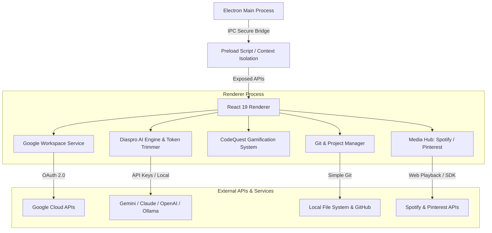

<p align="center">
  
</p>

<p align="center">
  
  
  
  
  
</p>

---

## What is Diaspro Viboard?

**Diaspro Viboard** è il **Desktop Productivity Hub Gamificato** di nuova generazione per sviluppatori e creator. Combina la gestione dei progetti locali, la sincronizzazione profonda con **Google Workspace**, un assistente **IA Multi-Provider (Diaspro AI)** contestuale con Function Calling, integrazioni multimediali (**Spotify, Pinterest, GitHub**) e un sistema di **Gamificazione CodeQuest** in un'unica interfaccia elegante in Dark Mode.

Costruito sulle fondamenta di **Electron 34**, **React 19**, **Vite 6** e **Tailwind CSS 4**, Diaspro Viboard offre un'esperienza utente reattiva, fluida e ad altissima resa estetica.

---

## Quick Start & Forking Guide

Se desideri clonare, fare un fork o contribuire a **Diaspro Viboard**:

### 1. Clonare la repository
```bash
git clone https://github.com/maryvellous/epicsnail.git
cd epicsnail
```

### 2. Installare le dipendenze
```bash
npm install
```

### 3. Configurare le variabili d'ambiente (`.env`)
Crea un file `.env` a partire dal template fornito:
```bash
cp .env.example .env
```
Apri il file `.env` ed inserisci il tuo **Google Client ID** e (opzionalmente) il **Client Secret**:
```env
GOOGLE_CLIENT_ID=vostro_client_id.apps.googleusercontent.com
GOOGLE_CLIENT_SECRET=vostro_client_secret
```

### 4. Avviare in ambiente di sviluppo
```bash
npm run dev
```

### 5. Eseguire la suite di test
```bash
npm test
```

### 6. Creare il pacchetto ed il file eseguibile (.exe)
```bash
npm run dist
```

---

## Key Features

### Onboarding Wizard & Easy Setup
* **First-Run Guided Setup**: Wizard interattivo al primo avvio per la configurazione rapida di credenziali, chiavi API, account Google e personalizzazione del profilo.

### Google Workspace Master Hub
* **Login 1-Click Google OAuth**: Identità master sincronizzata con avatar, profilo e permessi trasparenti.
* **Google Tasks & Calendar Sync**: Visualizzazione dei task quotidiani e degli eventi in vista *Oggi* e nel *Calendario*, con spunta e aggiornamento in tempo reale.
* **Google Drive & Docs Preview**: Accesso istantaneo ai documenti di lavoro all'interno delle schede di progetto.

### Diaspro AI — Multi-Provider Assistant
* **Supporto LLM Universale**: Collega in totale sicurezza Google Gemini, Anthropic Claude, OpenAI, DeepSeek o modelli locali via Ollama.
* **Autonomous Function Calling**: Esecuzione intelligente di azioni (creazione eventi Calendar, issue GitHub, controllo player Spotify) con approvazione utente *Human-in-the-Loop* per le operazioni mutative.
* **Context-Aware Assistance & Token Trimming**: Lettura automatica di eventi e task del giorno con ottimizzazione dinamica del contesto di memoria (`TokenTrimmer`).
* **Secure Key Vault**: Gestione cifrata e locale delle chiavi API.

### Gamification & CodeQuest
* **Sistema XP & Level Up**: Guadagna punti esperienza completando task, pushando commit ed eseguendo sessioni di lavoro.
* **CodeQuest & JS Sandbox**: Sfide di programmazione ed enigmi interattivi integrati con esecuzione locale e sicura degli snippet JavaScript.
* **XP Pop Notification**: Reazioni visive ed effetti dinamici al raggiungimento dei milestone.

### Media & Dev Integration Hub
* **GitHub Smart Deduplication**: Sync automatico delle repository Git locali con le corrispondenti remote GitHub, rilevamento branch attivo, ultimo commit e modifiche pendenti.
* **Spotify Smart Player**: Controllo riproduzione e playlist di sottofondo per le sessioni di deep work.
* **Pinterest Moodboard Grid**: Griglia visiva per bacheche e ispirazioni di design all'interno dei dettagli progetto.
* **Floating Sticky Notes**: Foglietti adesivi in overlay 3D espandibili e trascinabili per appunti al volo.

### Aesthetic & Design System Vibe
* **Curated Dark Palette**: Canvas scuro (`#1e1333`), card tridimensionali (`#2b1c47`) e toni accento armoniosi (Lavender, Warm Sand, Sage, Blue Accent).
* **Strict Zero-Emoji UI**: Iconografia raffinata ed omogenea basata esclusivamente sui componenti vettoriali `AestheticIcons` e `BrandIcons`.
* **Global Command Palette**: Ricerca rapida globale via modale istantanea.

---

## Architecture Overview



---

## License

Rilasciato sotto licenza [MIT License](LICENSE).

